# Check Availability

A Django web application for managing and checking the availability of rooms and workers.

## Link to calendar repository
[django-scheduler](https://github.com/llazzaro/django-scheduler)

## Features

- User registration, login and password reset
- View worker availability
- Change worker availability between `Present` and `Absent`
- View room availability and room calendars
- Add calendar events
- View application rules
- Admin-only management of workers, rooms and rules

## User Roles

### Regular User

- View workers and their availability
- Change their own availability status
- View rooms and room calendars
- View rules
- Add calendar events

### Administrator

Administrators have all regular user permissions and can additionally:

- Add and edit workers
- Add and edit rooms
- Add and edit rules

## Screenshots

### Login

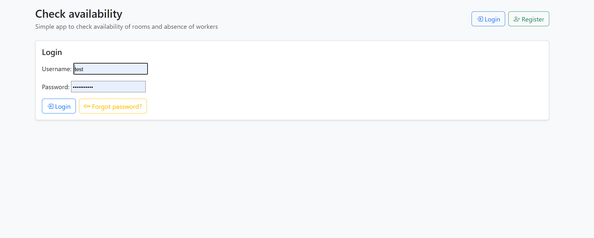

### Registration

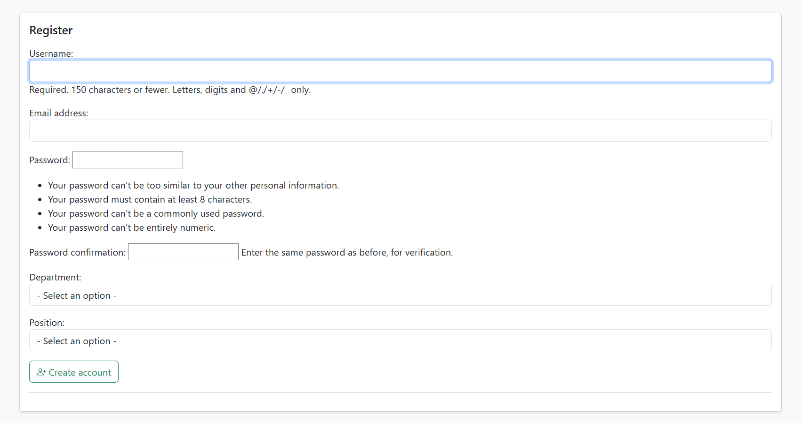

### Password Reset

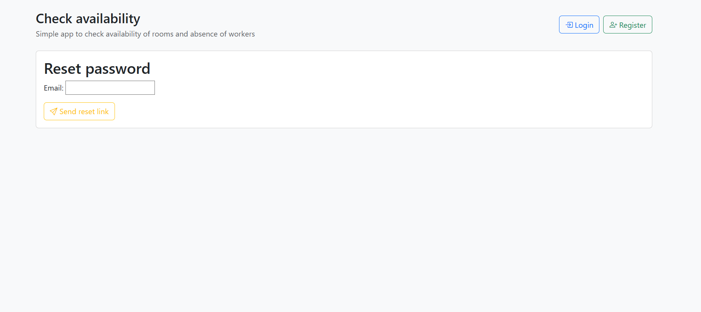

### Worker List

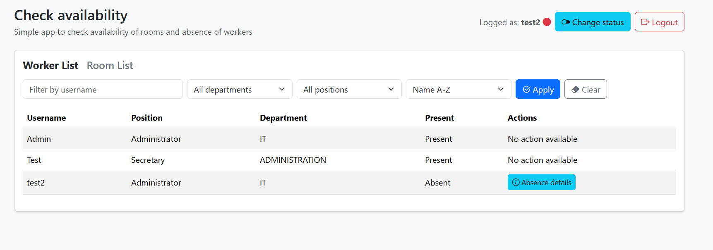

### Worker List - Admin

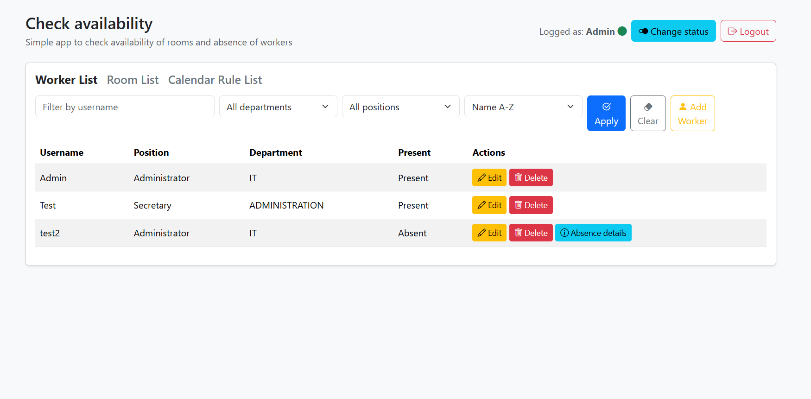

### Change Worker Status

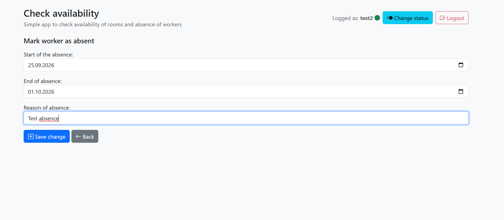

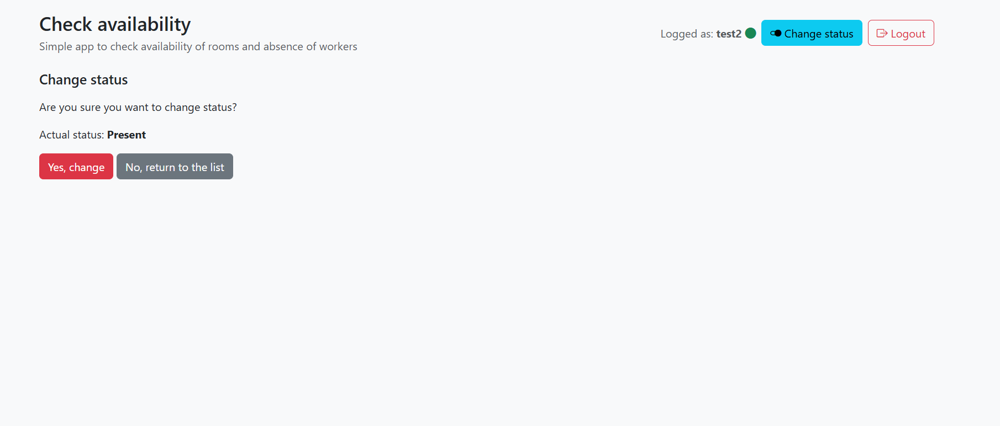

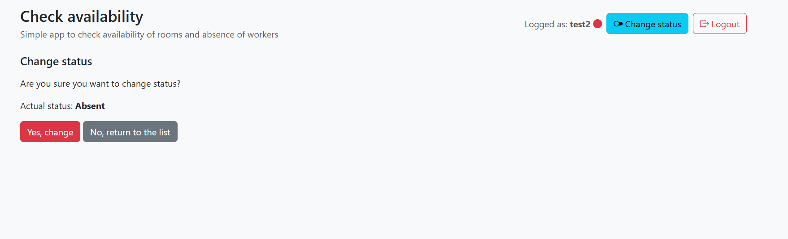

### Status Details

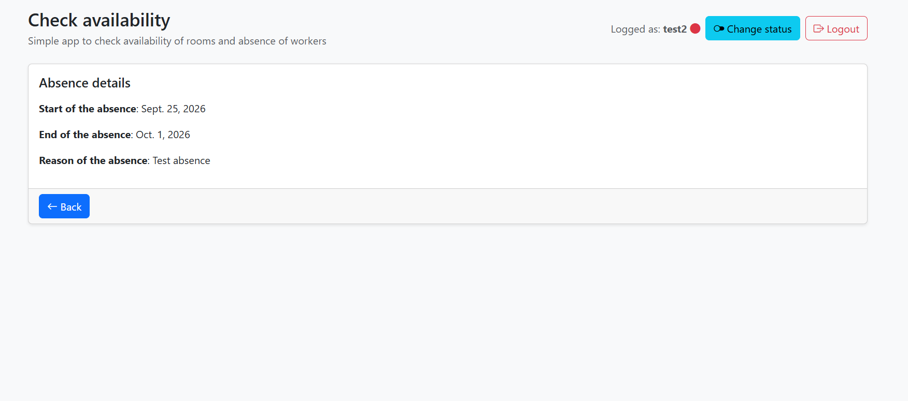

### Room List

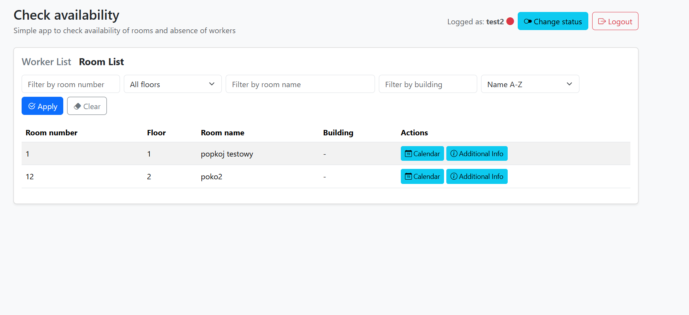

### Room List - Admin

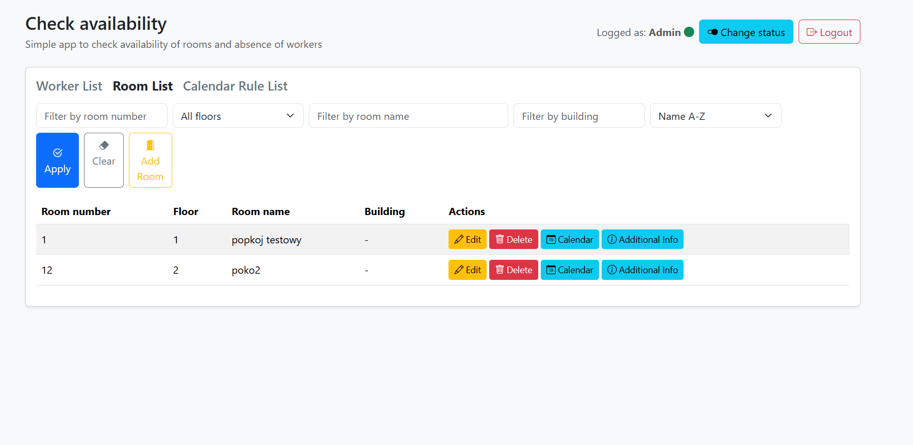

### Room Information

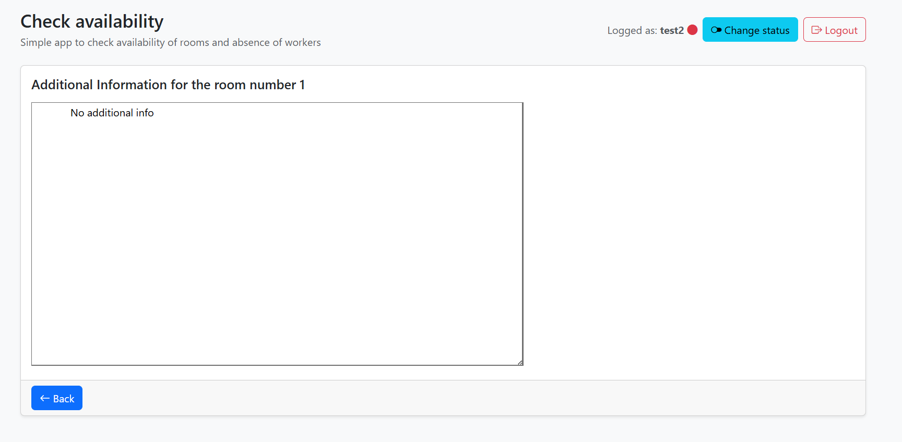

### Room Calendar

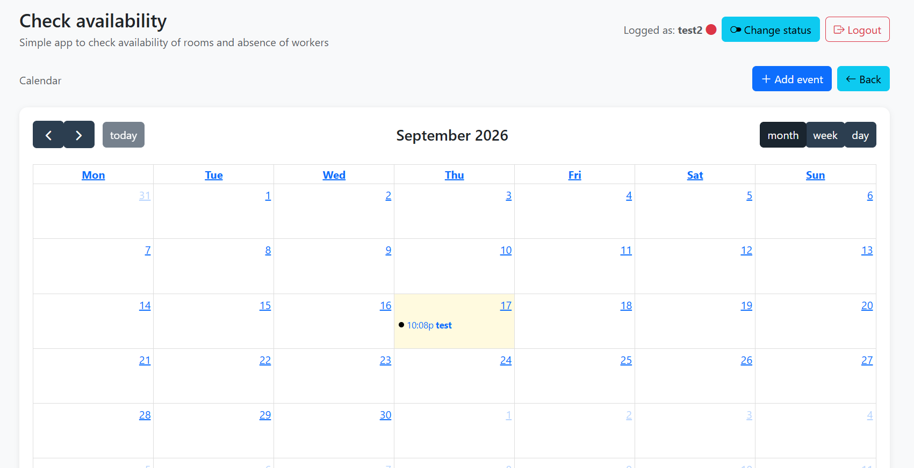

### Add Event

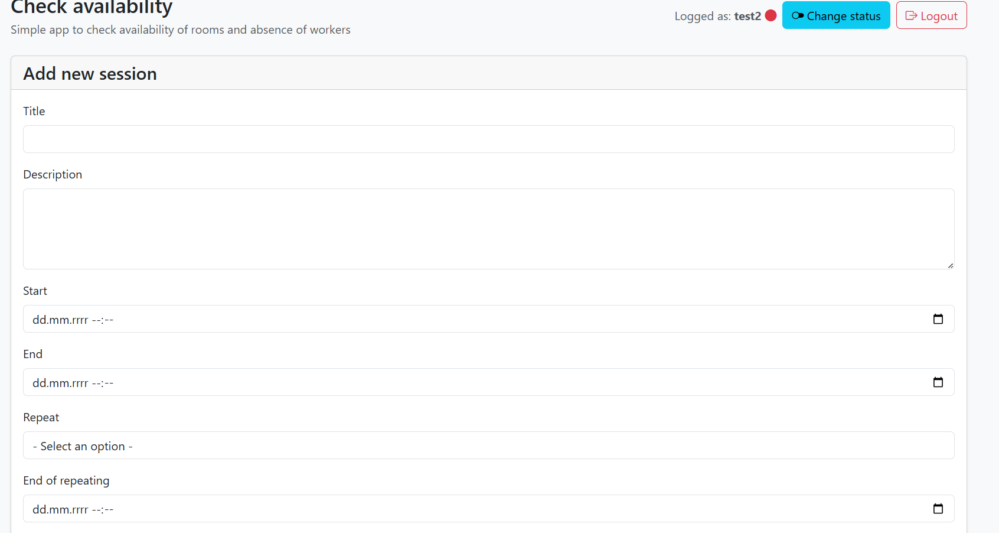

### Rules

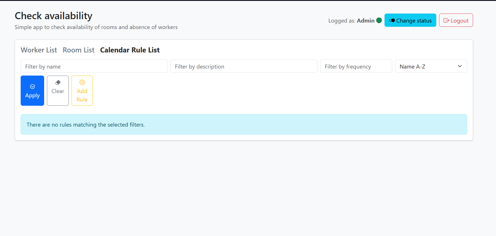

## Technology

- Python
- Django
- django-scheduler
- SQLite
- Docker
- Docker Compose
- HTML / CSS

## Installation

### Local

```bash
git clone https://github.com/StanislawMarszalek/Internship-project-Check-Availability.git
cd Internship-project-Check-Availability

python -m venv .venv
```

Activate the virtual environment and install dependencies:

```bash
pip install django
pip install django-scheduler
```

Run migrations:

```bash
python manage.py migrate
```

Start the application:

```bash
python manage.py runserver
```

The application will be available at:

```text
http://127.0.0.1:8000/
```

### Docker

```bash
docker compose up
```

The application will be available at:

```text
http://127.0.0.1:8000/
```

## Administrator Account

Create an administrator account with:

```bash
python manage.py createsuperuser
```

## Project Structure

```text
Internship-project-Check-Availability/
├── CheckAvailabilityApp/
├── RoomAndWorkerAvailabilityApp/
├── templates/
├── screenshots/
├── Dockerfile
├── docker-compose.yaml
├── manage.py
└── .dockerignore
```

## Author

Stanisław Marszałek

[GitHub Repository](https://github.com/StanislawMarszalek/Internship-project-Check-Availability)
